# Brazilian E-commerce Data Analytics Pipeline

## Project Overview

This project implements a comprehensive data analytics pipeline for Brazilian e-commerce data using modern data engineering and analytics tools. The pipeline ingests and processes data from Kaggle's Brazilian E-Commerce Public Dataset (Olist), to provide key business insights and drive data-informed decision-making.

**Team**: Group 3 - NTU SCTP Data Science and AI Program (Module 2 Final Project)

**Members**:
- Chan Weng Siong
- David Huang
- Lee Wei Hsien
- Loo Yawei
- Mark Chong

## Architecture

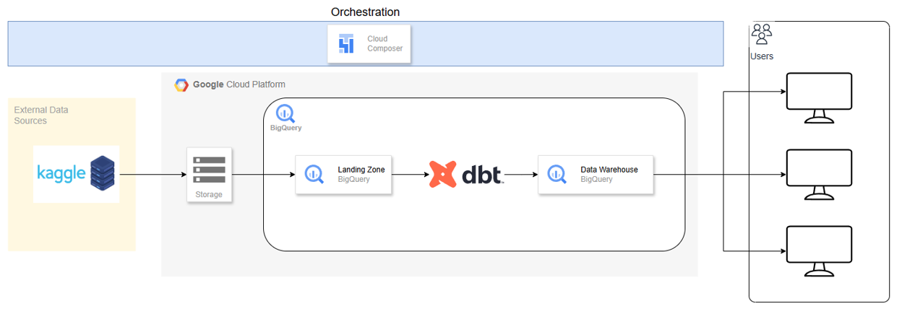

The project follows a modern ELT (Extract, Load, Transform) architecture using:

- **Data Source**: Kaggle's Brazilian E-Commerce Public Dataset (Olist)
- **Orchestration**: Google Cloud Composer (Apache Airflow)
- **Storage**: Google Cloud Storage (Data Lake)
- **Data Warehouse**: Google BigQuery
- **Transformation**: dbt (Data Build Tool)
- **Analytics**: Star Schema Data Modeling
- **CI/CD**: GitHub Actions for automated deployment

### Data Lineage
```
Kaggle Dataset → GCS (Raw Data) → BigQuery (Landing Zone) → dbt (Star Schema) → BigQuery (Analytics) → Analytics
```

## Setup Instructions

### Prerequisites
- Google Cloud Platform account with billing enabled
- Required GCP APIs enabled:
  - Cloud Composer API
  - BigQuery API
  - Cloud Storage API
- Kaggle account with API credentials

### GCP Infrastructure Setup

1. Create GCS buckets
    - landing bucket: `dsai-g3-m2-landing-bucket`
    - composer bucket: `composer-brazilian-ecommerce-bucket`
    - dbt docs site bucket: `brazilian-ecommerce-dbt-docs`

2. Create BigQuery datasets
    - landing zone: `gcs_ingestion`
    - star schema: `brazilian_ecommerce_sales`

## Data Source

The data is sourced from Kaggle's Brazilian E-Commerce Public Dataset (Olist), which contains a comprehensive set of data from real-world e-commerce transactions. The dataset includes information about customers, products, sellers, orders, and payments, among other relevant entities.

## Data Ingestion

The data is ingested into the data pipeline using following steps:

1. Download the dataset programmatically using Kaggle API
    ```bash
    kaggle datasets download -d {dataset}
    ```
2. Upload the data to a designated Google Cloud Storage (GCS) bucket which serves as the data lake and centralized storage system.

### Why load data to GCS?
- **Centralized and Durable Data Lake**:  GCS serves as a central data lake where raw data from different sources can be stored in its original format.
- **Separation of Raw Data and Processing Layers**: It helps to decouple ingestion from transformation and ensures that raw data is preserved in its original form, which is helpful for debugging, auditing and reprocessing.
- **Scalability and Flexibility**: GCS can handle structured, semi-structured and unstructured data of any volume. It can scale easily. Unlike traditional databases, there is no schema or size restriction at the ingestion stage, allowing flexibility in handling a wide variety of datasets.
- **Cost Efficiency**: GCS is more cost-effective for storing large volumes of raw data compared to transactional databases. E.g. the cost for standard storage in Singapore region (per GB per month) is just $0.020.
- **Smooth Integration with Google Cloud Services**: GCS can integrate natively with other components in Google cloud including BigQuery, Cloud Composer and Cloud Functions etc.

## Data Warehouse

After ingesting raw e-commerce datasets into a Google Cloud Storage (GCS) bucket, the next stage in our data pipeline involves loading these datasets into BigQuery. This step moves the data from our data lake into a structured analytical environment where it can be queried, validated, and transformed.

### Benefits of Choosing BigQuery:
- Fully managed and serverless data warehouse
- Seamless integration with Google Cloud services such as direct loading from GCS
- OLAP database which is optimized for large-scale analytics that can handle petabyte-scale datasets
- SQL-based interface which support standard SQL
- Built-in security and governance with support for IAM-based access control and data encryption
- Easy integration with modern data stacks. E.g. dbt for transformation and Cloud Composer for orchestration.

## Loading Raw Data from GCS to BigQuery Landing Zone

The landing zone in BigQuery is a designated dataset (or schema) used to store raw, untransformed data directly as it arrives from the ingestion layer. It serves as the initial touchpoint in the warehouse environment, before the data undergoes any transformation or enrichment.

- Supports ELT Best Practices
- Scalability and Performance
- Unified raw data and Query Layer
- Simplified Architecture
- Security and Access Control

**Process Steps:**
1. Identify raw files in GCS bucket.
    - File location: gs://dsai-g3-m2-landing-bucket/brazilian-ecommerce/
2. Create BigQuery Landing Zone Dataset.
    - Dataset name: gcs_ingestion
3. Load data from GCS into BigQuery tables using CLI
    - Specify:
        - Source format (CSV)
        - Schema (autodetect)
        - Table name 
4. Validate the load.
    - Check record counts, schema accuracy and any load errors.

## Data Transformation

After loading raw e-commerce data into the BigQuery landing zone, we use dbt (Data Build Tool) to perform transformations, apply business logic, and run data quality tests. dbt enables modular SQL transformations while leveraging BigQuery's scalable and cost-efficient compute engine.

This phase converts raw data into clean and analysis-ready datasets.

**Benefits of using DBT:**
- Modular and reusable, where SQL transformation models can be easily managed and reused
- Compatible with modern data warehouses such as BigQuery, Snowflake, Redshift, etc
- Software engineering practices like testing, version control and documentation are integrated into the dbt workflow
- Supports scheduled runs for continuous data transformation
- Open-source and community-driven, with no vendor lock-in

## Schema Design

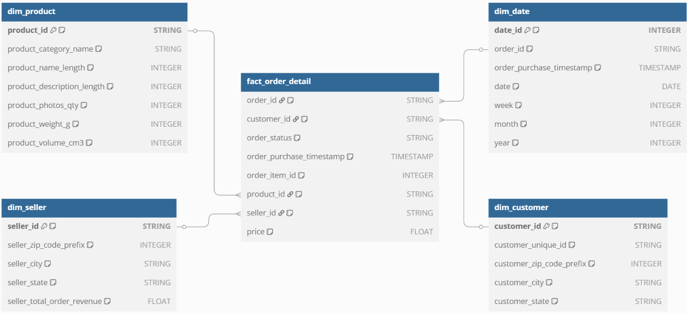

The project implements a **Star Schema** design optimized for analytical queries:

### Fact Table
- `fact_orders` - Order-level aggregated metrics including items and delivery performance
- `fact_order_items` - Individual order item details with product and seller relationships

### Dimension Tables
- `dim_customers` - Customer information and geographic location data
- `dim_products` - Product details including categories (with English translations) and specifications
- `dim_sellers` - Seller information and geographic location data

## DBT Setup

1. Project Setup
    - Create a new directory for the dbt project. In this project, the directory is `e-commerce-dbt`.
    - Create a new dbt project by running `dbt init` in the project directory.
    - Define the project key settings in the `dbt_project.yml` file.
        - project name and version
        - profile to use for this project
        - clean-targets to remove the target and dbt_packages directories

2. SQL Model Configuration
    - Create the fact and dimension tables in the `models` directory by defining the SQL files and schema files in the `star_dim` and `star_fact` directories

3. Profile Configuration
    - Create `profiles.yml` file in the project directory
    - Specify the profile to use for this project in the `profiles.yml` file
    - Define the target environment and the BigQuery database connection settings in the output configurations
    - Two output profiles are configured:
        - `dev` (default target) for development and testing using account key file locally
        - `prod` for production deployment using oauth authentication in Cloud Composer

4. Package Configuration
    - Create `packages.yml` file in the project directory
    - Define the package dependencies in the `packages.yml` file
    - The project uses the following packages:
        - `dbt_utils` for utility macros and tests
        - `dbt_expectations` for advanced data quality expectations
        - `dbt_date` for date utility functions
    - Run `dbt deps` command to install the packages

5. Data Transformation
    - Run `dbt run` to run the dbt project
        - Connect to the target database (BigQuery)
        - Execute the SQL transformation models defined in the `models` directory to materialize the data into fact and dimension tables in BigQuery

        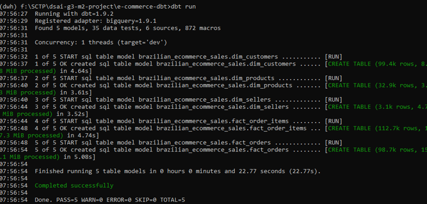

6. Data Quality Testing
    - Comprehensive data quality tests are implemented using dbt_utils and dbt_expectations packages, which are defined in the `schema.yml` file
    - The tests include:
        - Null checks
        - Primary Key Uniqueness
        - Linkage checks
        - Valid Timestamp
        - Column Types checks
        - Valid postal code value
        - Column value in acceptable range    
    - Run `dbt test` to execute the data quality tests

        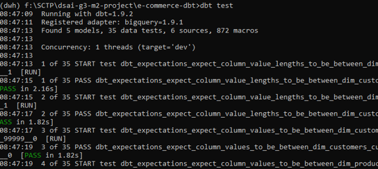

7. Data Documentation
    - Provide a visual and searchable catalog of data models, complete with descriptions, dependencies, and source, tests and lineage.
    - Compiles metadata about all models, sources, tests, and exposures into a static website.
    - Creates a rich graph of model dependencies using dbt's DAG (Directed Acyclic Graph).
    - Outputs documentation as an HTML file and JSON artifact in the target/ folder.
    - Run `dbt docs generate` to generate the interactive documentation 

        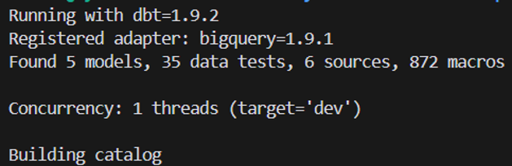

    - Can be served locally by running `dbt docs serve` or deployed to cloud storage/static site hosts for team access.

        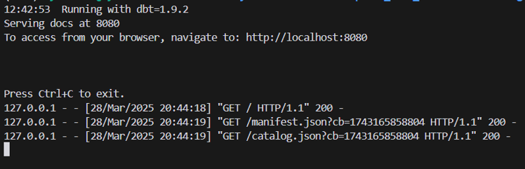

## End-to-End Pipeline Orchestration

To automate and orchestrate our entire data pipeline — from data ingestion to transformation — Google Cloud Composer is used, a fully managed workflow orchestration service based on Apache Airflow.

### Advantages of using Cloud Composer:

1. Native Integration with Google Cloud Platform (GCP)
    - Deeply integrated with BigQuery, GCS and IAM.
2. Fully Managed Airflow
    - Google handles dependency management, upgrades and patching
3. Scalable and Reliable for Production Pipelines
    - Dynamic task mapping
    - Task retries & dependencies and parallel task execution
4. Standardization with Apache Airflow
    - Leverages Airflow’s ecosystem with extensive community support and plugins
5. Built-in Monitoring, Logging, and Alerts
    - Integrated with Cloud Logging and Cloud Monitoring
6. Security and Access Control
    - Supports IAM roles and service accounts for secure and granular permissions

## Google Cloud Composer

Cloud Composer coordinates each stage of the pipeline in a reliable, repeatable, and auditable manner, ensuring that dependencies are respected and failures are handled gracefully.

### Pipeline Stages Orchestrated:
We use 3 separate DAGs in Cloud Composer to orchestrate the pipeline in modular stages:
1. Ingestion
    - scheduled to run every 2 days for testing purposes using a CRON expression `0 0 */2 * *`
2. Landing to BigQuery
    - not scheduled but is triggered programmatically by DAG 1 upon successful completion.
3. Transformation, Testing & Documentation
    - triggered by DAG 2 after the data has been successfully loaded to BigQuery.

The DAGs files can be found in the [`gcp-composer/dags`](./gcp-composer/dags) directory.

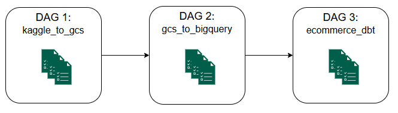

## Cloud Composer Setup

1. Create Composer 3 environment with "small" type of environment resources.
2. Select a designated GCS bucket for this composer environment.
    - This bucket is used to store the DAGs Python files and dbt project folder.
3. Set Airflow Configuration Overrides as below.
    - This is useful for setting up the email notification system.

    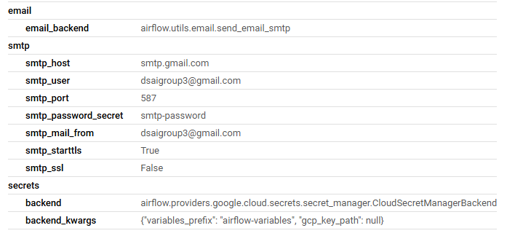

4. Configure Environment Variables
    - Set the Kaggle API key as an environment variable. [PS: The Kaggle API key value is stored in the GCP Secret Manager]

    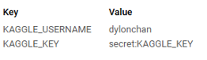

5. Configure PyPI Packages
    - Add the necessary PyPI packages to the environment.

    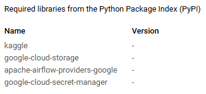

## Google Cloud Composer Airflow UI

The Airflow UI provides a web-based interface to monitor and manage the pipeline.

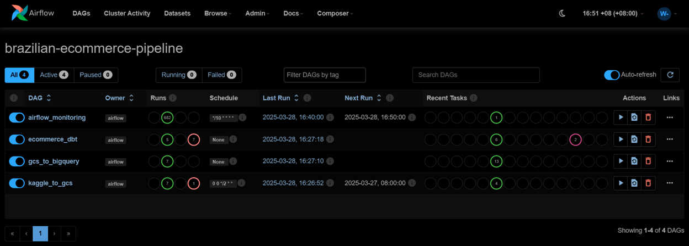


## Pipeline Workflow

### DAG 1: kaggle_to_csv

1. Run Kaggle command to download the dataset
2. Unzip the downloaded dataset using PythonOperator
3. Upload the extracted files to GCS using GCSHook
4. Trigger the next DAG (DAG 2)

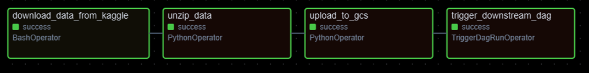

### DAG 2: load_to_bq

1. Retrieve the GCS bucket name and folder path from the previous DAG (DAG 1)
2. Get the list of CSV files in the GCS bucket and folder
3. Map the CSV files to the corresponding BigQuery tables names
4. Load all CSV files as tables in parallel to the designated dataset in BigQuery using GCSToBigQueryOperator
5. Trigger the next DAG (DAG 3)

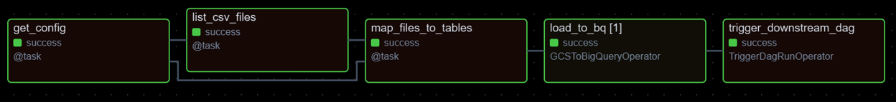

### DAG 3: ecommerce_dbt

1. Use BashOperator to run `dbt clean` to remove the target and dbt_packages directories
2. Use BashOperator to run `dbt deps` to install the dbt packages
3. Use BashOperator to run `dbt run` to build the data models
4. Use BashOperator to run `dbt test` to execute the data quality tests
5. Run if all the previous tasks are successful
    - 5a. Use BashOperator to run `dbt docs generate` to build dbt docs site
    - 5b. Host the dbt docs static site in GCS bucket
6. Run if at least one of the previous tasks failed
    - 6a. Extract the dbt test log if test failed
    - 6b. Send email notification to the team

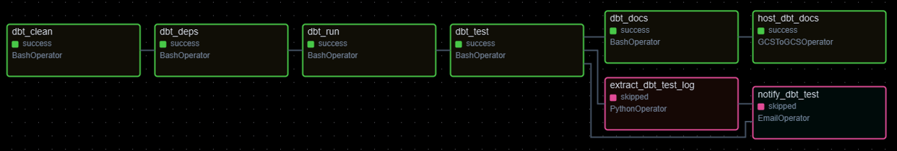

### DBT Docs Site hosted in GCS

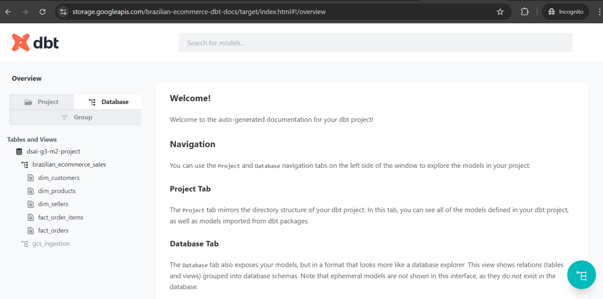

### Email Notification when Test Failed

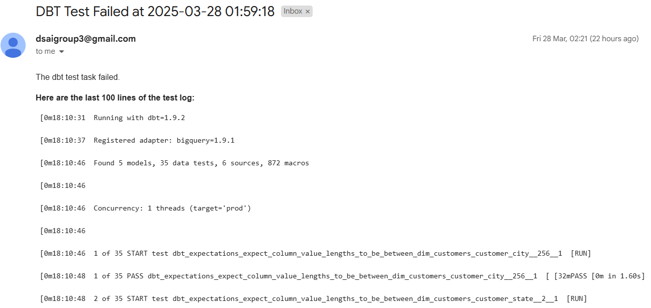
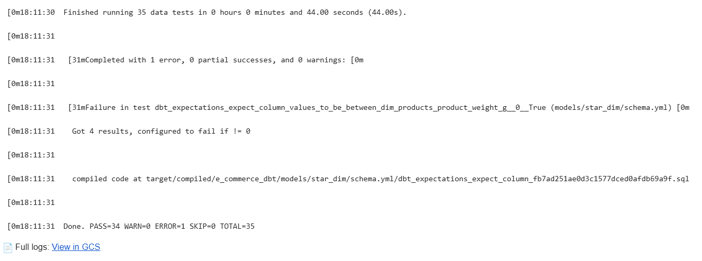


### GitHub Actions CI/CD

1. Create a GCP Service Account and grant it the appropriate role.
2. Create a GCP Workload Identity Provider following the steps in the [Google GitHub Actions Auth](https://github.com/google-github-actions/auth).
3. Configure the following secrets in your GitHub repository:
    - `workload_identity_provider`: GCP Workload Identity Provider
    - `service_account`: GCP Service Account
4. Create a workflow YAML file as shown in the [`.github/workflows/deploy.yml`](./.github/workflows/deploy.yml) file.

## End User Analytics

Steps to perform data analysis to obtain insights:

1. Use SQLAlchemy to connect to and pull data from BigQuery.
2. Use `pandas` to extract and tabulate the required data for analysis
3. Use `matplotlib` to visualize the data.

## Key Analytics Insights

Revenue Growth MoM was more volatile in 2017 and stabilized in 2018.

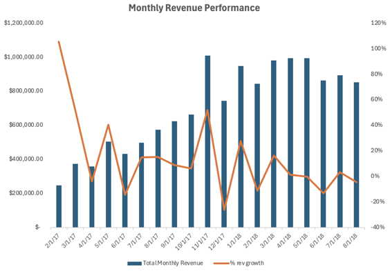

Revenue breakdown by order status, with 97.78% order completion rate.

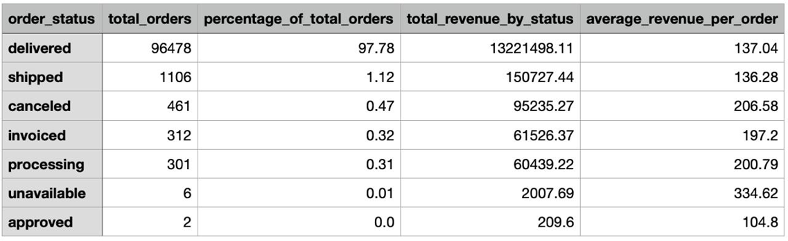

The **Top 3 performing states** in Brazil by revenue are SP (São Paulo), RJ (Rio de Janeiro) and MG (Minas Gerais).

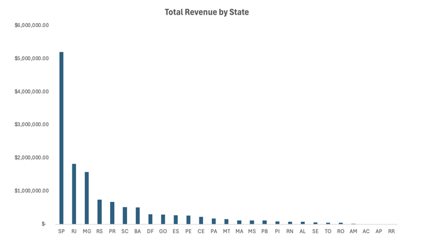

The **Top 3 performing cities** in Brazil by revenue are São Paulo, Rio de Janeiro and Belo Horizonte, which are the state capital of SP, RJ and MG.

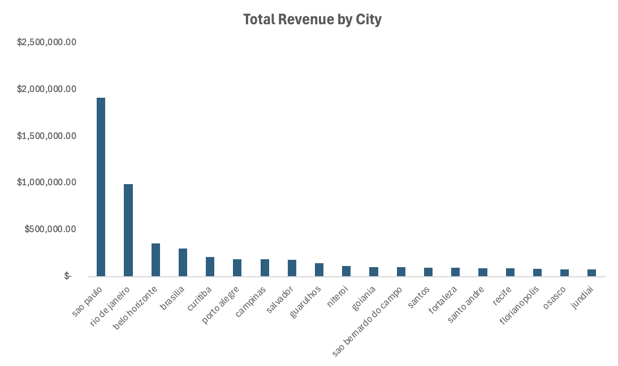

The **Top 3 states** with the largest sellers' revenue are SP (São Paulo), followed by PR (Curitiba), MG (Minas Gerais), and RJ (Rio de Janeiro).

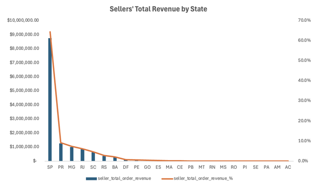

## Resources & References

- [Brazilian E-Commerce Dataset](https://www.kaggle.com/datasets/olistbr/brazilian-ecommerce)
- [dbt Documentation](https://docs.getdbt.com/)
- [Google Cloud Composer](https://cloud.google.com/composer)
- [Apache Airflow Documentation](https://airflow.apache.org/docs/apache-airflow/stable/core-concepts/index.html)
- [BigQuery Documentation](https://cloud.google.com/bigquery/docs)
- [dbt Expectations Package](https://github.com/calogica/dbt-expectations)
- [Google GitHub Actions Auth](https://github.com/google-github-actions/auth)

## Project Deliverables

- ✅ Fully automated ELT pipeline
- ✅ Star schema data warehouse
- ✅ Comprehensive data quality testing
- ✅ Interactive analytics capabilities
- ✅ CI/CD deployment pipeline (Additional feature)
- ✅ Documentation and monitoring (Additional feature)
